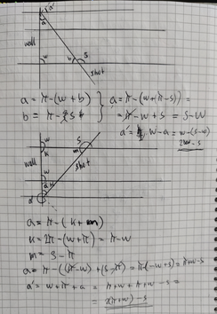
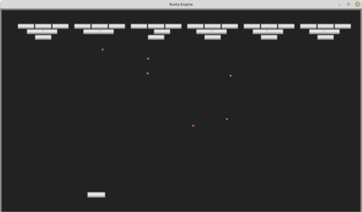

# rusty-breakout: experiments with the rusty-engine

After having finished `rusty-asteroids`, I wanted
to try and see if I could write a simple `Breakout` game.

## Install and run

After cloning, download the assets:

    cd rusty-breakout
    curl -L https://github.com/CleanCut/rusty_engine/archive/refs/heads/main.tar.gz | tar -zxv --strip-components=1 rusty_engine-main/assets

then compile and run:

    cargo run
    
## Controls

TBD

## Some notes

First I started to think about how to calculate the bounces off
a wall when a ball hits it. I scratched my head and scribbled
down some situations. I came up with three cases:

1. The ball hits the wall perpendicular. In this case it should
bounce straight back, i.e we rotate the incoming angle with PI radians.

2. The ball hits the wall with a shot rotation less than PI.
The answer turned out to be `2*W-S` (W=rotation of wall, S=rotation of shot).

2. The ball hits the wall with a shot rotation greater than PI.
The answer turned out to be `2*(PI+W)-S`.

To create the walls I made use of the nifty `level_creator` tool.
I started by constructing the walls by smaller "brick" pieces, but
I soon realized that it was easer to just use one brick and then
scale it up really large and position it mostly off screen. This
way I got nice thin solid walls.

I continued with the `leve_creator` to form an upside pyramid of blocks
that I adjusted a bit by hand. Then a little loop to create a chain
of pyramid blocks.

The collision handling was very similar to `rusty-asteroids` and with that
I had a fully working `rusty-breakout` game... :-)

